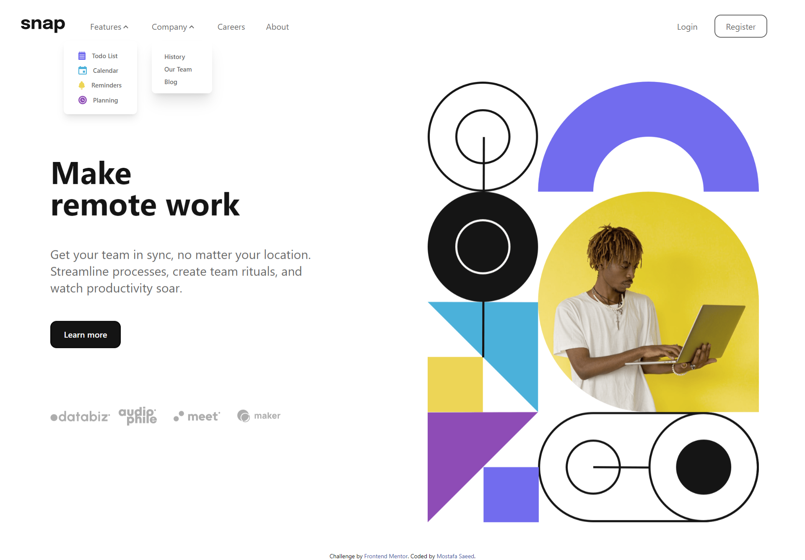

# Frontend Mentor - Intro section with dropdown navigation solution

This is a solution to the [Intro section with dropdown navigation challenge on Frontend Mentor](https://www.frontendmentor.io/challenges/intro-section-with-dropdown-navigation-ryaPetHE5). Frontend Mentor challenges help you improve your coding skills by building realistic projects. 

## Table of contents

  - [The challenge](#the-challenge)
  - [Screenshot](#screenshot)
  - [Links](#links)
  - [Built with](#built-with)
  - [What I learned](#what-i-learned)
  - [Author](#author)


### The challenge

Users should be able to:

- View the relevant dropdown menus on desktop and mobile when interacting with the navigation links
- View the optimal layout for the content depending on their device's screen size
- See hover states for all interactive elements on the page

### Screenshot




### Links

- Solution URL: [https://github.com/Desha-Saeed/snap-website]
- Live Site URL: [https://snap-website-demo-47wnvy6yz-desha-saeed.vercel.app/]

## My process

### Built with

- Semantic HTML5 markup
- Tailwind CSS
- Mobile-first workflow


### What I learned

I learned more about tailwindcss with this project also it was my first time trying the mobile-first approach
```


## Author


- Frontend Mentor - [@Desha-saeed](https://www.frontendmentor.io/profile/Desha-Saeed)


